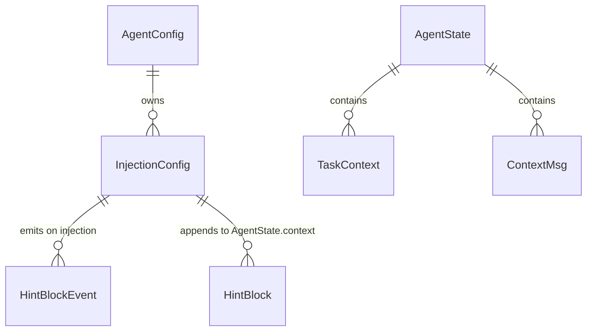

# Data Model: Agent 运行时状态注入系统

**Feature**: 026-runtime-state-injection | **Date**: 2026-08-04
**上游基准**: Python AgentScope `9d1026fa` `agent/_config.py::InjectionConfig`、`agent/_agent.py::_inject_runtime_state`、`message.HintBlock`

## 实体总览



| 实体 | 载体 | 说明 |
|------|------|------|
| `InjectionConfig` | `agent_scope_agent::config` | 注入配置，随 `AgentConfig` 构建 |
| `HintBlock` | `agent_scope_message::block` | 注入产生的上下文块（已存在） |
| `HintBlockEvent` | `agent_scope_event::block_events` | 注入事件（已存在） |
| `AgentState` / `TaskContext` | `agent_scope_state` | 注入评估的数据来源（已存在） |

## InjectionConfig（新增）

`agent_scope_agent::config::InjectionConfig` — 运行时状态注入的完整配置。

### 字段

| 字段 | 类型 | 默认值 | 说明 |
|------|------|--------|------|
| `inject_runtime_state` | `bool` | `true` | 总开关；`false` 时三维均不评估、不注入、不发事件 |
| `timezone` | `String` | `"UTC"` | IANA 时区名；解析失败回退 UTC |
| `time_format` | `String` | `"%Y-%m-%dT%H:%M:%S"` | 时间注入/解析格式，须可往返完整时间戳 |
| `time_interval` | `f64` | `0.5` | 距上次注入的最小间隔（小时），≥ 0 |
| `context_buffer_ratio` | `f64` | `0.2` | 上下文用量注入的缓冲比例，∈ [0,1] 且 < trigger_ratio |
| `template` | `String` | 见下 | 注入包装模板，必须含 `{runtime_state}` 占位符 |
| `injection_source` | `String` | `{"label": "System", "sublabel": "Runtime State"}` | 注入来源标识，感知检测的依据 |
| `task_tool_names` | `Vec<String>` | `["TaskCreate","TaskGet","TaskList","TaskUpdate"]` | 视为"已感知任务"的工具名列表 |
| `extra_fields` | `HashMap<String, String>` | `{}` | 附加字段，附着于每次注入但不触发注入 |
| `emit_hint_event` | `bool` | `true` | 注入时是否发射 `HintBlockEvent` |

**默认模板**（对齐 Python）：

```text
<system-reminder>Treat the following as the ground truth at this point of the conversation. Anything stated earlier is outdated, and a later reminder, if any, supersedes this one:
{runtime_state}
</system-reminder>
```

### 校验规则（`InjectionConfig::validate`）

| 规则 | 违规行为 |
|------|---------|
| `template` 必须包含 `{runtime_state}` | 返回 `AgentError::InvalidConfig`，不静默丢弃 |
| `time_format` 必须可往返（format→parse） | 同上 |
| `time_interval >= 0` | 同上 |
| `0 <= context_buffer_ratio <= 1` | 同上 |
| `context_buffer_ratio < ContextConfig.trigger_ratio` | 同上 |
| `timezone` 无效 | **不拒绝**，运行时回退 UTC（对齐 Python） |

## 注入结果模型（内部）

统一管线一次调用产生 **至多一条** HintBlock 追加到 `state.context`，并可能产生 **至多一个** `HintBlockEvent`：

```text
HintBlock {
    source:  Some(injection_source),
    hint:    Text(template.replace("{runtime_state}", joined_fields)),
    id:      默认生成,
    created_at: 默认生成,
    finished_at: None,
}
```

`joined_fields` 按固定顺序 `\n` 连接（对齐 Python 注入顺序，FR-013）：

1. 时间命中：`<current-time>{now formatted}</current-time>\n<timezone>{timezone}</timezone>`
2. 任务命中：`<tasks>You have {in_progress} in-progress tasks and {pending} pending tasks. Use `TaskList` to view them if you don't know.</tasks>`
3. 上下文命中：`<context-length>Your current context contains {input_tokens} tokens. When reaching {trigger_tokens} tokens, your context will be compressed.</context-length>`
4. 附加字段（恒附着）：`<{k}>{v}</{k}>`（按 `extra_fields` 遍历）

## 感知检测输入

统一管线反向扫描 `state.context` 中 `role = assistant` 的消息，用于：

| 用途 | 检测项 |
|------|--------|
| 时间维度 | 找到 `source == injection_source` 且文本含 `<current-time>` 的最新 HintBlock → 解析记录时间 |
| 任务维度 | 找到 `source == injection_source` 且文本含 `<tasks>` 的 HintBlock，或 `name ∈ task_tool_names` 的 ToolCallBlock → 视为已感知任务 |

## 状态转换

| 转换 | 触发条件 | 结果 |
|------|---------|------|
| 时间注入 | 无记录时间 / 解析失败 / 超间隔 / 时钟回拨 | 追加含 `<current-time>` 的 HintBlock |
| 任务注入 | 有未完成任务 + 上下文不感知 + 双开关开启 | 追加含 `<tasks>` 的 HintBlock |
| 上下文注入 | 首轮 + token 落入预警窗口 | 追加含 `<context-length>` 的 HintBlock |
| 压缩移除 | 上下文压缩替换/截断 | 三维各自按规则重新注入 |
